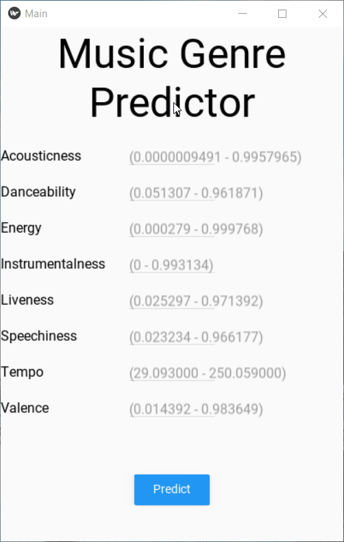

# Music Genre ML Android
This is a cross platform app which predicts whether a song is rock or hip-hop depending upon parameters passed by the user. The parameters are passed to the model which is hosted on Heroku. API Link: https://kivymlapp.herokuapp.com/

Here is the quick dmeo of the app:

The whole code (App + API) is available here: https://github.com/kaustubhgupta/KivyMLApp